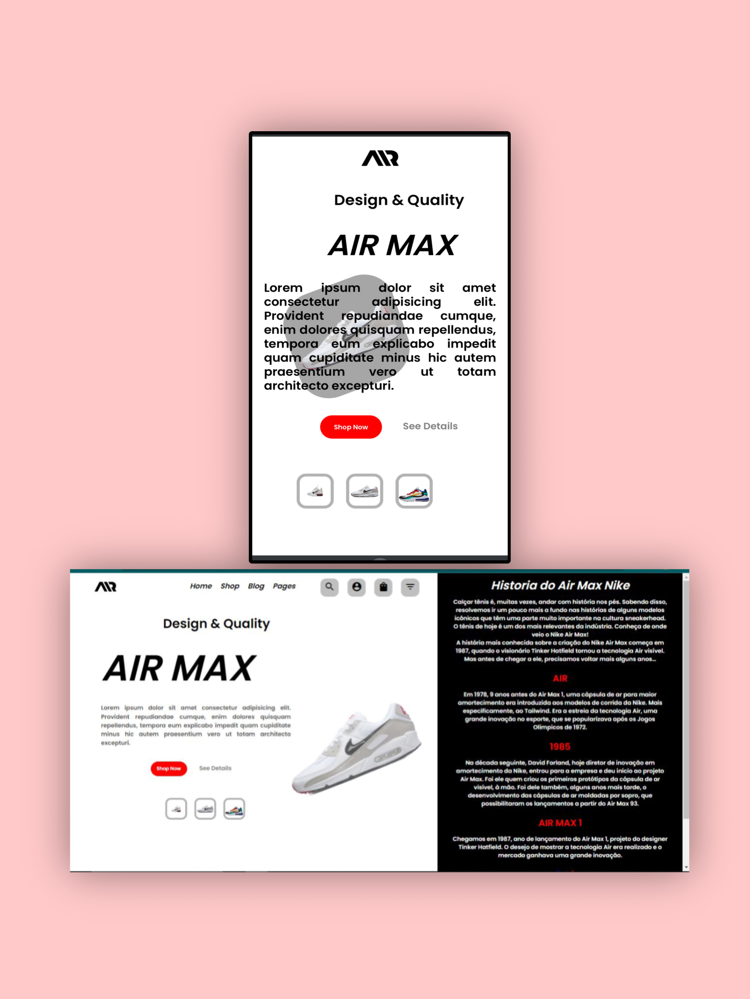

# AIR-MAX

<h1> OLÁ TUDO BEM?</h1>

 ESSE E MAIS UM PROJETO DESENVOLVIDO POR MIM JÁ RESPONSIVO PARA MOBILE, ESSE FOI MAIS UM APRENDIZADO,

 

O PROJETO VEM COM A TROCA DE IMAGEM AO TOCAR NAS IMAGENS NO FINAL DA PAGINA, TROCA O TÊNIS AO LADO DOS ELEMENTOS,

 

JÁ NO MOBILE A PÁGINA PERDE ALGUNS ELEMENTOS MAIS AINDA GANHA NO REQUISITO DE TROCA DE IMAGEM

 
 

<h1 text-align="center"> SEGUE ABAIXO A FOTO DO PROJETO</h1>

